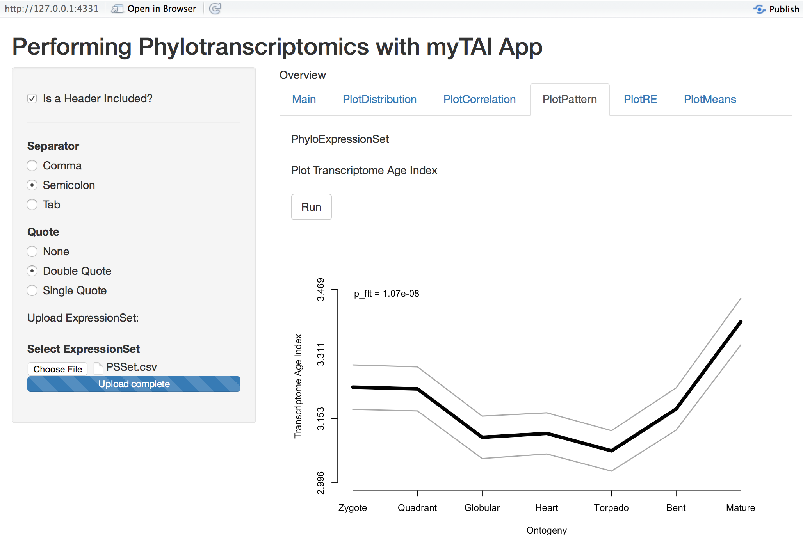

# The `myTAI` Web Application




## Please note that this app is in an early stage and is under constant development 

## Download App

A Shiny App to Perform Phylotranscriptomics with [myTAI](http://cran.r-project.org/web/packages/myTAI/index.html)

```r
# install shiny
install.packages(shiny)

# install myTAI
install.packages(myTAI)
```

Now download this repository and run the App in RStudio.